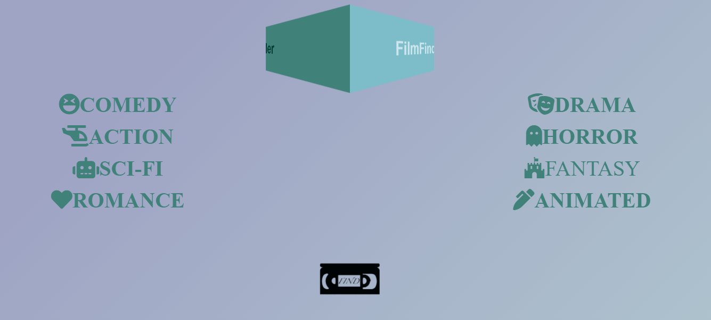
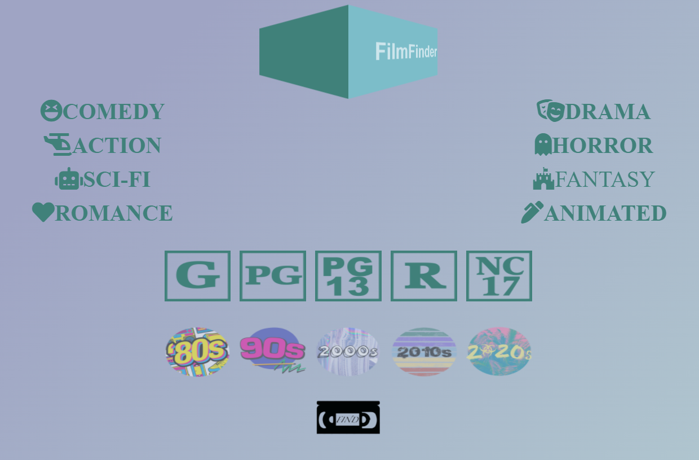
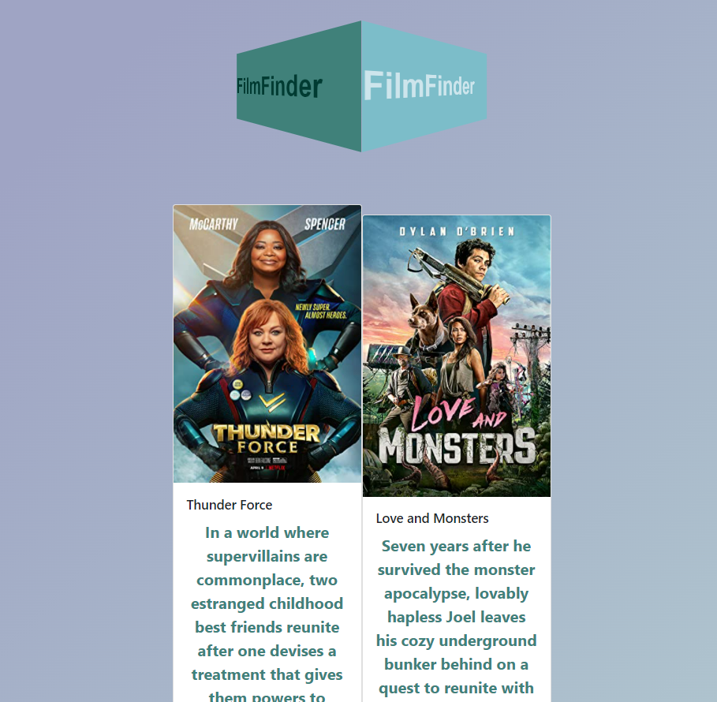

# FilmFinder

## Description
The motivation behind creating this app was so that people could have a way to save time on looking for a movie and instead use
that time watching a movie. Sometimes it feels as if you've spent over an hour looking for a movie and then you give up after
not having found what you are looking for. The goal of our app is to give you one place that narrows your search down to what you
are looking for while searching multiple streaming platforms at once. Through this project we have learned how valuable of a
resource APIs are when it comes to making an app like ours.

## Installation
No installation is required.

## Usage

When the page loads the user will see a list of genres to choose from.

After selecting a genre the user will then be able to select a content rating (PG, PG-13, ect.) and a decade from which the movie was released. The user can choose both a content rating and decade or just one of the two.

Then the user will click the search button which will bring them to a page that has the movie results based on the perimeters
given.

## Credits
Contributors:
    Chase: https://github.com/ChaseKY
    Bryan: https://github.com/bryanorbe
    Ramil: https://github.com/ramochkin
    
APIs Used:
    Data-Imdb: https://rapidapi.com/SAdrian/api/data-imdb1/
    OMDB: http://www.omdbapi.com/

## License
Copyright (c) 2022 Chase Young

Permission is hereby granted, free of charge, to any person obtaining a copy of this software and associated documentation files (the "Software"), to deal in the Software without restriction, including without limitation the rights to use, copy, modify, merge, publish, distribute, sublicense, and/or sell copies of the Software, and to permit persons to whom the Software is furnished to do so, subject to the following conditions:

The above copyright notice and this permission notice shall be included in all copies or substantial portions of the Software.

THE SOFTWARE IS PROVIDED "AS IS", WITHOUT WARRANTY OF ANY KIND, EXPRESS OR IMPLIED, INCLUDING BUT NOT LIMITED TO THE WARRANTIES OF MERCHANTABILITY, FITNESS FOR A PARTICULAR PURPOSE AND NONINFRINGEMENT. IN NO EVENT SHALL THE AUTHORS OR COPYRIGHT HOLDERS BE LIABLE FOR ANY CLAIM, DAMAGES OR OTHER LIABILITY, WHETHER IN AN ACTION OF CONTRACT, TORT OR OTHERWISE, ARISING FROM, OUT OF OR IN CONNECTION WITH THE SOFTWARE OR THE USE OR OTHER DEALINGS IN THE SOFTWARE.
